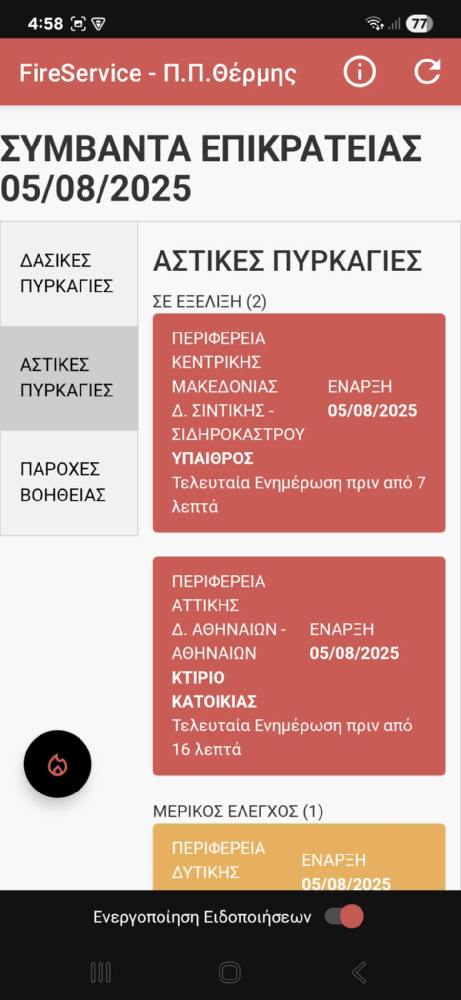
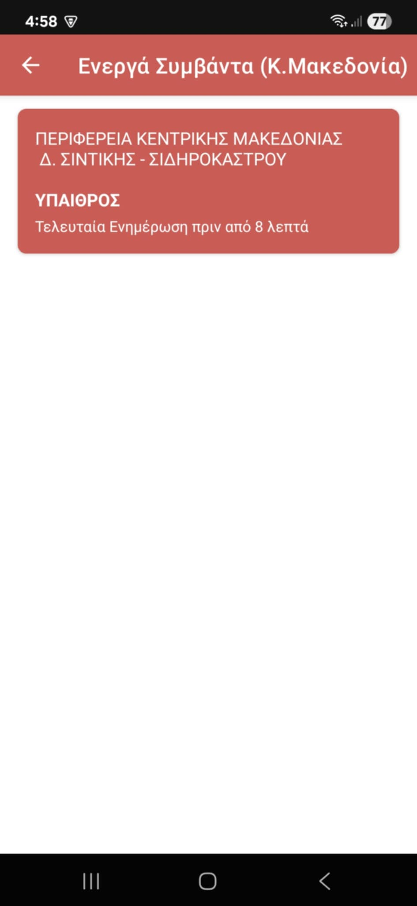
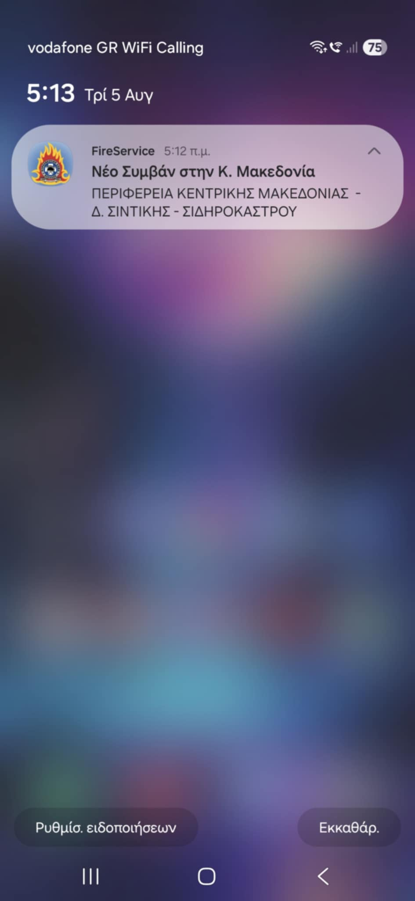
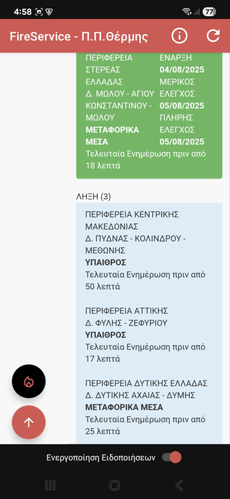
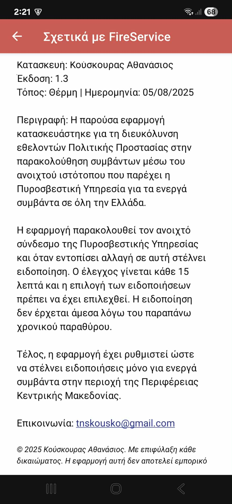

# FireService - Android App

  <h3>Central Macedonia Emergency Incident Monitor</h3>
  
An Android implementation of Greece's Official Fire Service Website for monitoring and announcing all active emergency incidents across the country.

  
  
  
  
  

## Description

A volunteer-focused application that automatically monitors Greece's official Fire Service website for new emergency incidents using web scraping technology. Using Android's optimized background processing, the app checks for updates every 15 minutes - balancing timely notifications with battery efficiency.

When new incidents are detected in Central Macedonia, users receive immediate push notifications. Built entirely for non-commercial, volunteer civil protection purposes.

## Features

- **Real-time Push Notifications** - Instant alerts for new incidents in Central Macedonia
- **Automated Monitoring** - Background checks every 15 minutes for optimal battery usage
- **Active Incidents View**: Browse all current active incidents with detailed information
- **Instant Manual Refresh** - Bypass the Fire Service website's 1.5-minute auto-refresh cycle with a reload button for immediate updates
- **Offline Support** - View previously loaded incidents even without internet connection
- **Region-Specific Filtering** - Focuses only on Central Macedonia incidents
- **Free & Open Source** - Built for volunteers, by volunteers

## Demo Screenshots

| Main Interface | Active Incidents | Push Notifications |
|:---:|:---:|:---:|
|  |  |  |
| **Live Fire Service Data** | **Central Macedonia Incidents** | **Real-time Alerts** |
| Browse official incident reports with real-time updates and navigation controls | View filtered incidents specific to Central Macedonia with detailed information | Instant push notifications for new emergency incidents |

| Website Integration | App Information |
|:---:|:---:|
|  |  |
| **Full Website Access** | **About & Settings** |
| Complete Fire Service website integration with scroll-to-top functionality | App details, version info, and developer contact information |

## Download & Installation

### Direct APK Download

### Installation Steps
1. **Download APK** from releases or build from source
2. **Enable "Unknown Sources"** in Android settings  
3. **Install and launch** the app
4. **Grant notification permissions** when prompted
5. **Enable notifications** in app settings

### Build from Source
1. Clone this repository
2. Open in Android Studio
3. Build and install on your Android device
4. Grant notification permissions when prompted
5. Enable notifications in the app settings

## Technical Details

- **Target Region**: Central Macedonia, Greece (ΠΕΡΙΦΕΡΕΙΑ ΚΕΝΤΡΙΚΗΣ ΜΑΚΕΔΟΝΙΑΣ)
- **Data Source**: [Official Fire Service Website](https://museum.fireservice.gr/symvanta/) (Emergency Incidents Portal)
- **Check Interval**: 15 minutes (Android WorkManager optimized)
- **Minimum Android Version**: API 24 (Android 7.0+)
- **Target SDK**: API 35 (Android 15)

### Architecture & Components

- **Background Processing**: Android WorkManager for reliable periodic tasks
- **Web Scraping**: JSoup library for HTML parsing and data extraction
- **Data Storage**: SharedPreferences for incident tracking and user settings
- **UI Components**: 
  - RecyclerView with custom adapter for incident lists
  - Material Design components for modern UI
- **Notification System**: Android NotificationManager with custom channels
- **Incident Management**: 
  - MD5 hashing for stable incident IDs
  - Duplicate detection and cleanup algorithms
  - Region-based filtering system
- **Networking**: HTTP connections with 30-second timeout handling
- **Error Handling**: Retry mechanisms for network failures

## Permissions Required

- `INTERNET`: For accessing the Fire Service website
- `POST_NOTIFICATIONS`: For push notifications (Android 13+)
- `WAKE_LOCK`: For background monitoring

## Configuration

The app is pre-configured to monitor incidents in Central Macedonia if you enable the Notification option available in the app. The monitoring service:
- Runs every 15 minutes in the background
- Generates stable incident IDs using MD5 hashing
- Filters incidents by region automatically
- Maintains notification history to prevent duplicates

## Usage

1. **Enable Notifications**: Toggle the notification switch in the main screen
2. **View Website**: Browse the official Fire Service website within the app
3. **Active Incidents**: Tap the floating action button to view current incidents
4. **Scroll to Top**: Use the scroll-to-top button for easy navigation

## Contributing

This application is developed for volunteer civil protection purposes. If you'd like to contribute or suggest improvements, please contact the developer.

## Disclaimer

- This app is **not affiliated** with the official Greek Fire Service
- Developed for **volunteer use only** - not for commercial purposes
- Notifications may have up to 15-minute delays due to the checking interval
- Always verify critical information through official channels

## License

This project is licensed under the GNU General Public License v3.0 - see the [LICENSE](LICENSE) file for details.

**Important**: This application is developed exclusively for voluntary, non-commercial purposes. Commercial use or redistribution for profit is strictly prohibited.
